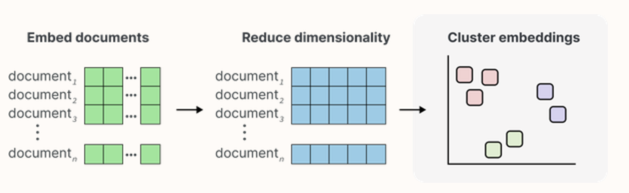

# Library
<p align="center">
    
    
</p>

`embedprepro` is a command-line tool designed for text analysis tasks, including embedding, clustering, dimensionality reduction, and visualization. This tool leverages various machine learning and data processing techniques to provide a comprehensive solution for text data analysis.



## Table of Contents

- [Installation](#installation)
- [Usage](#usage)
  - [Command-line Interface](#command-line-interface)
    - [Embedding](#embedding)
    - [Dimensionality Reduction](#dimensionality-reduction)
    - [Clustering](#clustering)
    - [Visualization](#visualization)
  - [Importing in Your Project](#python-project)

# **Installation**

You can install the package directly using pip:

```
!pip install -U embedprepro==0.1
```

If you prefer to install the package from the source, clone the repository and install it using pip:

```

git clone https://github.com/
cd text_analysis_cli
pip install .
```

# **Usage**

## **Command-line Interface**

The **`text_analysis_cli`** provides a command-line interface for performing various text analysis tasks.

```jsx
embedprepro [OPTIONS] COMMAND [ARGS]...
```

The main commands available are:

- clustring
- embedding
- reduction
- visualization

To get help on any command, use the **`--help`** option:

```

embedprepro COMMAND --help

```

### **Embedding**

Generate embeddings for text data using a specified model and embedder type.

```jsx
embedprepro embedding <input_file> <output_file> [options]
```

- input file: the file contain your data (example.csv)
- output file: the file you want to saved the result (result.npy)

**Options**

| Option | Description | Default |
| --- | --- | --- |
| --et | Embedder type | sentence_transformer |
| --mn | Model name | all-MiniLM-L6-v2 |
| --col | Column name in the input CSV file containing text | text |
| --bs | Batch size | 32 |
| --p | Number of parallel processes | 1 |
- **available emebdder type**

| Embedder | available |
| --- | --- |
| sentence_transformer | ✅ |

```bash
embedprepro embedding input.csv output_embeddings.npy --et sentence_transformer --mn all-MiniLM-L6-v2 --col text --bs 32 --p 2
```

### **Dimensionality Reduction**

Reduce the dimensionality of text embeddings.

```jsx
embedprepro reduction <input_file> <output_file> [options]
```

- if input is text data then reduction firstly embed data before reduction
- you can also make [embeding.](http://embediing.py)npy  as input_file bby adding **`--with_embedding 1` option**

| Option | Description | Default |
| --- | --- | --- |
| --nc | Number of components to reduce to | 2 |
| --ng | Number of neighbors | 15 |
| --md | Minimum distance | 0.5 |
| --metric | Distance metric | euclidean |
| --et | Embedder type | sentence_transformer |
| --mn | Model name | all-MiniLM-L6-v2 |
| --col | Column name in the input CSV file containing text | text |
| --algorithm | Dimensionality reduction algorithm | PCA |
| --with_embedding | Use precomputed embeddings | False (0) |
- **available Reduction Algorithm**
    
    
    | Algorithm | available |
    | --- | --- |
    | PCA | ✅ |
    | UMAP | ✅ |

```jsx
embedprepro reduction input.csv dimreduction.npy --nc 2 --ng 15 --md 0.5 --metric euclidean --et sentence_transformer --mn all-MiniLM-L6-v2 --col text --algorithm PCA --with_embedding False
```

### **Clustering**

Perform agglomerative clustering on text data or embeddings.

```jsx
embedprepro clustering <input_file> <output_file> [options]
```

- if input is text data then clustering firstly embed data before clustering

**Options**

| Option | Description | Default |
| --- | --- | --- |
| --et | Embedder type | sentence_transformer |
| --mn | Model name | all-MiniLM-L6-v2 |
| --col | Column name in the input CSV file containing text | text |
| --bs | Batch size | 32 |
| --p | Number of parallel processes | 1 |
| --threshold | Clustering threshold | 0.5 |
| --min_cluster_size | Minimum cluster size | 1 |
| --show_progress_bar | Show progress bar | True (1) |
| --with_embedding | Use precomputed embeddings | False (0) |

**example**

```jsx
 embedprepro clustering input.csv output_clusters.npy --et sentence_transformer --mn all-MiniLM-L6-v2 --col text --bs 32 --p 2 --threshold 0.5 --min_cluster_size 1 --show_progress_bar True --with_embedding False
```

### **Visualization**

Visualize the results of dimensionality reduction and clustering.

```jsx
embedprepro visualization <clusters_data> <reduced_data> [options]
```

- with visualization you can plot your clustered and reduced data with 2d or 3d plot.
- to use 3d plot you need just add `—zi`

**Options**

| Option | Description | Default |
| --- | --- | --- |
| --xi | Index of the first dimension | 0 |
| --yi | Index of the second dimension | 1 |
| --zi | Index of the third dimension | -1 |
| --title | Title of the plot | Clusters |
| --xlabel | Label of the x-axis | X |
| --ylabel | Label of the y-axis | Y |
| --zlabel | Label of the z-axis | Z |
| --save | Save path for the plot | None |

**example**

```jsx
embedprepro visualization dimreduction.npy output_clusters.npy --xi 0 --yi 1 --zi 2 --title "Clusters" --xlabel "X" --ylabel "Y" --zlabel "Z"
```

## Python Project

after installation you can use embedprepro inside your python project like this:

```jsx
from preprocessing import *
```

from preprocessing package you can import:

- embedding_service
- agglomerative_clustering
- dimensionality_reduction
- visualization_service
